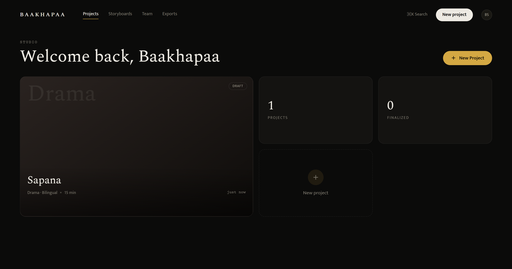
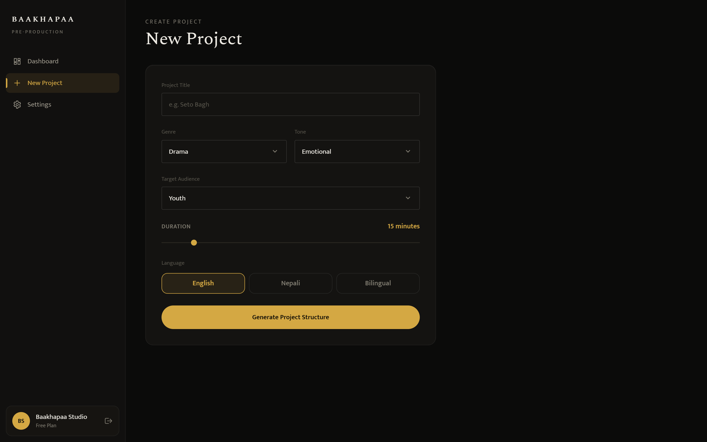
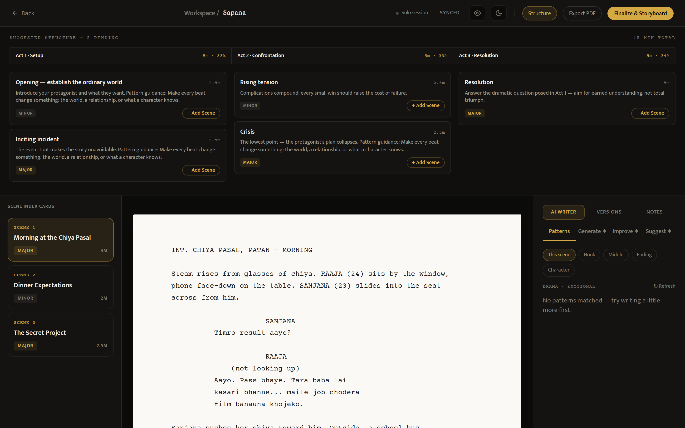
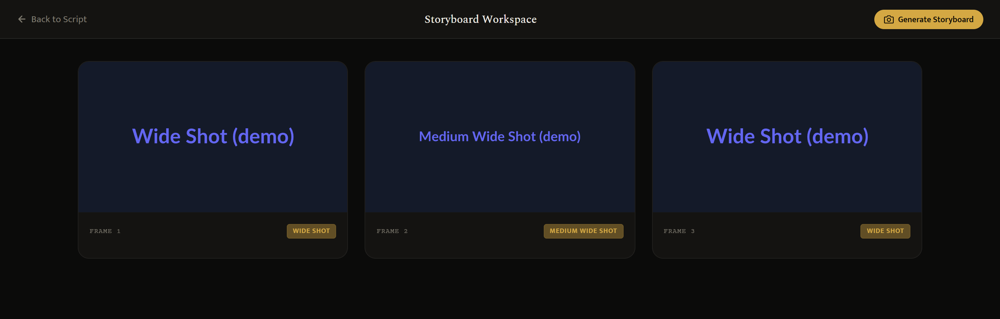
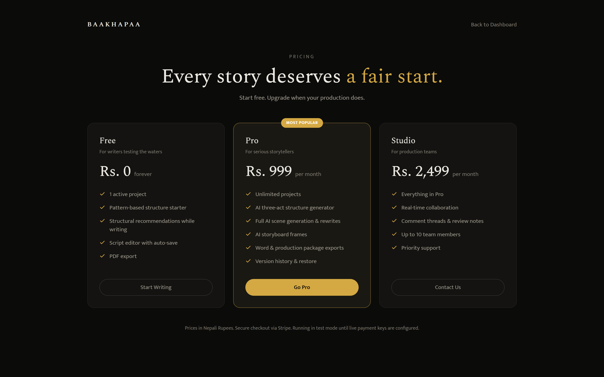

# Month 1 progress report

**Baakhapaa: AI-powered pre-production intelligence system**
Weeks 1 to 4 of 12. Reference: proposal §8.

All four Month 1 deliverables work. Five modules scheduled for Months 2 and 3 are built as
well, and the script generator gained one capability the proposal never mentioned:
semantic retrieval over a library of analysed story structures. Every screenshot in this
report was captured from the running system.

## 1. Month 1 deliverables

| Wk | Build focus | Deliverable | Status |
|----|-------------|-------------|--------|
| 1 | Project setup | Project structure, database schema, user authentication working | Done |
| 2 | Script editor UI | Screenplay editor interface built and styled in browser | Done |
| 3 | AI script generation | Genre input, three act structure, scene time allocation working | Done |
| 4 | AI assistance mode | Generation, improvement, and suggestion modes live. Bilingual output working. | Done |

### Week 1: Project setup

FastAPI backend: 17 modules, 34 routes. React 18 frontend with Tailwind: 22 components and
pages. Eight tables cover User, Project, Script, Scene, StoryboardFrame, Version, Comment
and Subscription. Registration, bcrypt hashing, JWT issuance and protected routes all work.

**Figure 1.** Dashboard after sign in. Reaching this screen exercises the whole auth path:
registration, login, JWT issuance and a protected route.

### Week 2: Script editor UI

The editor renders screenplay format in a fixed-pitch column, with a structure timeline
beside it and scene cards that jump to their place in the script.

### Week 3: AI script generation

Genre, tone, audience, duration and language are set before writing starts. The engine
returns a three-act frame split 33/33/34 percent, then divides each act into major
turning-point scenes and minor transitional ones. Each scene carries its own minute
allocation, cast, location and emotional beat. Structure arrives as a preview; scenes enter
the script one at a time, as the writer accepts them.

**Figure 2.** The parameters captured before any writing begins: genre, tone, target
audience, a duration slider, and a language choice of English, Nepali or bilingual.

### Week 4: AI assistance mode

The writer can generate a scene from a one-line brief, select any passage for a rewrite,
shortening or translation, or ask for continuations. Dialogue comes out in Nepali
Devanagari and action lines in English, shaped by a house-voice prompt rather than generic
screenplay English.

**Figure 3.** The editor with everything from Weeks 2 to 4 in one view. Across the top,
the three acts at 33/33/34 percent with per-scene minute allocations and major or minor
tags. Left, the scene index cards. Centre, the screenplay column holding bilingual
dialogue. Right, the AI Writer panel with its Patterns, Generate, Improve and Suggest
modes.

## 2. Work beyond Month 1 scope

### 2.1 Retrieval-augmented structure

Not in the proposal. Each request is embedded locally with a 384-dimension model and
matched by cosine similarity against 15 analysed story patterns, so a sports underdog brief
can pull structure from a boxing drama despite sharing no genre tag. A pgvector migration
is ready for when the library outgrows in-memory ranking. Free-tier users get the same
structural guidance without spending an API call.

### 2.2 Modules pulled forward

| Module | Delivered in Month 1 |
|--------|----------------------|
| Storyboard engine and UI | Six shot types assigned by scene position and act, frame grid, per-frame regeneration |
| Collaboration | Inline comment threads, collaboration presence bar |
| Version history | Auto-snapshot on save, restore points, diff between any two versions |
| Export system | PDF, Word, and a combined production package |
| Subscription system | Free, Pro and Studio tiers with checkout, webhooks and paid-tier gating on AI routes |

**Figure 4.** Storyboard frames generated from the finalized script, one per scene, each
tagged with the shot type the engine assigned from scene position and act. Frames read
"(demo)" because no image API key is configured.

**Figure 5.** The three subscription tiers: Free, Pro at Rs 999 per month and Studio at
Rs 2,499. Checkout runs through Stripe in test mode until live payment keys are set.

### 2.3 Other work

A security audit closed what it found: ownership checks on every route touching a script,
and field whitelists on updates so a client cannot write columns it was never offered.
There is also a command palette, a settings page, a pricing page, and a demo mode running
the whole system on local SQLite with mocked AI, so the platform can be reviewed without
provisioning an API key.

## 3. Verification status

Everything above has been run end to end in demo mode. None of it has been tested against
live Claude, DALL·E or Supabase credentials. That is the first task of next phase, along
with tuning tier limits and fixing Devanagari rendering in PDF export, which currently
falls back to a font that cannot draw the script.
