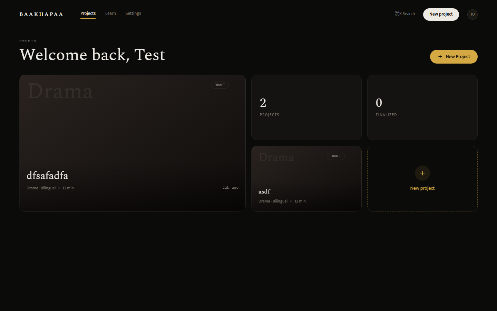
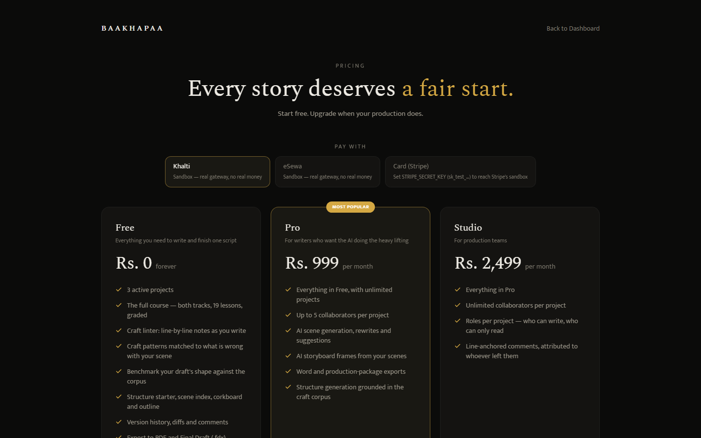
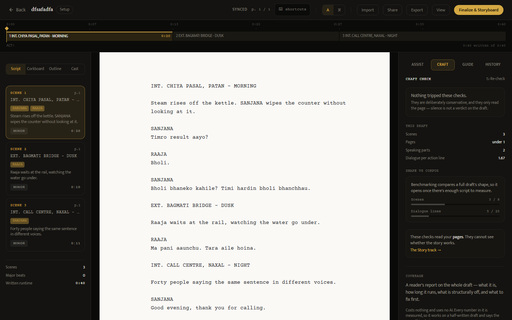
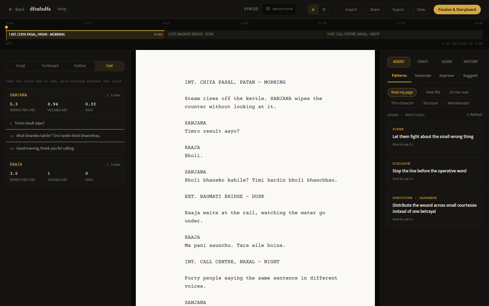
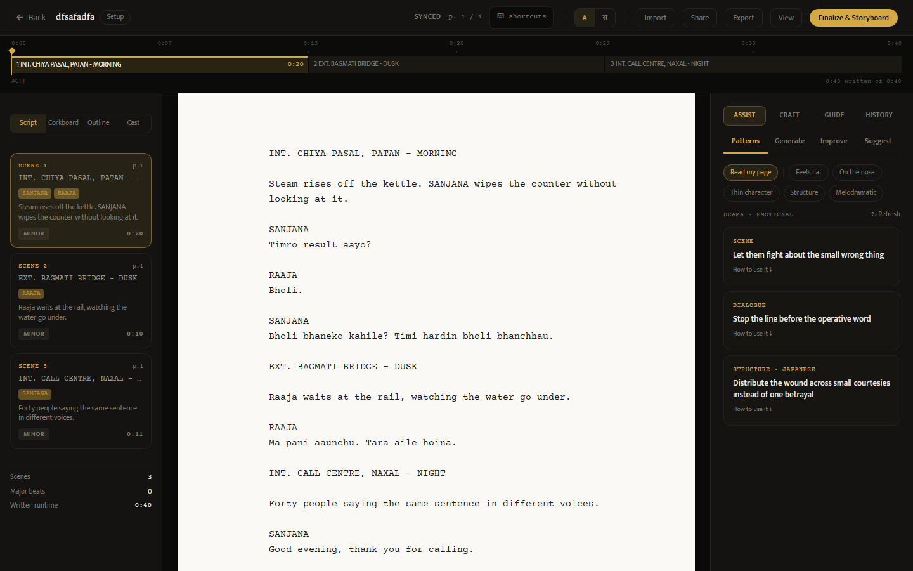
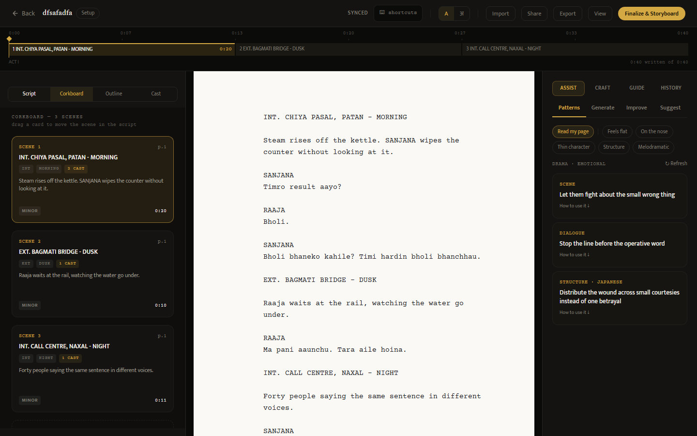

# Month 2 progress report

**Baakhapaa: AI-powered pre-production intelligence system**
Weeks 5 to 8 of 12  ·  Prepared for Baakhapaa  ·  Reference: proposal §8

All four Month 2 deliverables are complete. Each was built ahead of schedule during Month 1
and reported then; this month they were verified in detail, and three of the four were
extended in ways the earlier report could not claim. The sections below report against each
assigned deliverable in turn.

## 1. Month 2 deliverables

| Wk | Build focus | Deliverable | Status |
|----|-------------|-------------|--------|
| 5 | Storyboard generation | Shot types, camera notes, frame controls, regeneration | Done |
| 6 | Collaboration and versions | Comment threads, roles, version history with diff | Done |
| 7 | Export system | PDF, Word, Final Draft `.fdx`, production package | Done |
| 8 | Subscription tiers | Free / Pro / Studio with checkout and paid-tier gating | Done |

**Figure 1.** The dashboard, which is the entry point to every deliverable below. Projects
carry their genre, language and planned duration, and open directly into the editor. The free
plan allows three active projects, raised this month from one, because the course ends by
asking a writer to complete a short film and finishing it consumed the entire allowance.

### Week 5: Storyboard generation

The storyboard engine turns a finalized script into one frame per scene. Each frame is
assigned a shot type from a fixed vocabulary of nine — Wide Shot, Medium Wide Shot, Medium
Shot, Medium Close Up, Close Up, Extreme Close Up, Over The Shoulder, Point Of View and
Insert — chosen from the scene's position within its act rather than at random, so a
sequence opens wide and tightens as it approaches its turn.

The shot type is not chosen arbitrarily. A scene's position within its act, and the act's
position within the script, decide how tight the frame is: an act tends to open on a wide
establishing frame and close nearer the face, and a scene marked as a major turning point is
given a tighter shot than a transitional one beside it. The writer can override any of this,
and an override is never undone by a later regeneration.

The camera note is assembled from the same inputs plus the scene's cast, its time of day and
its emotional beat. A two-hander at night in a confined location produces a different note
from a crowd scene at dawn, without either requiring a model call. This is the part of the
storyboard a director actually reads, and it was previously blank on every frame the system
had ever produced.

Frames draw their description from the written draft where one exists and from the structure
beat where it does not, and they carry the scene's location, time of day, cast and the
project's genre. A writer can override the shot type, edit the camera note, reorder frames
and regenerate any single frame. Regeneration re-derives the description from the scene but
never overwrites a camera note the writer has edited.

Generation is capped at 24 frames per storyboard, since a long script would otherwise
produce a bill proportional to its length. This month the real cost was measured for the
first time. Images are produced by `gpt-image-1-mini` at 1536×1024, and one frame costs
**$0.0033** and takes about 19 seconds.

| Item | Previously estimated | Measured |
|------|----------------------|----------|
| One storyboard frame | $0.040 | **$0.0033** |
| 24-frame storyboard | $0.96 | **$0.08** |
| One script with a storyboard | $1.32 | **~$0.44** |

The earlier estimate assumed DALL-E 3, which the system does not use. The correction matters
for pricing: images are roughly 18% of what a script costs to produce and text generation
82%, so the effective control is the length of generated text rather than the frame cap.

Two faults were also found and fixed. The demo placeholder returned an SVG image, which the
PDF library cannot embed, so every demo production package printed "frame image not
embedded"; the placeholder now requests PNG. And image fetching during export is bounded by
a per-fetch timeout and a shared budget, and degrades to a captioned frame box rather than
failing, which is the normal case once generated image URLs have expired.

### Week 6: Collaboration and version history

**Comment threads.** Comments anchor to a line of the script and default to the line under
the caret, so a note lands where the writer is looking rather than requiring a line number
to be typed. Each is attributed to its author and threads are ordered by position in the
script rather than by time, so reading the notes means reading the script in order. A viewer
may comment; a project administrator may moderate.

**Roles.** Access is granted per project rather than globally, because a person is usually a
writer on their own work and a reader on somebody else's. The three roles are Administrator,
Editor and Viewer. The project owner is an administrator implicitly, so no data migration
was required to introduce the system. Every protected route takes a minimum required role
that defaults to Editor, which means forgetting to mark a route costs a viewer a read and
never grants an unintended write.

Sharing is also reachable from inside the editor, not only from settings, since the moment a
writer decides to share is the moment they are looking at the work.

**Invitations.** Anyone can be invited, including a person with no account. The invitation
link does not itself grant access — it describes the offer, and membership is granted when
somebody registers with the invited address. A link that granted access on click would be a
bearer token in a forwarded message. No email is sent, because there is no mail account
configured; the inviter passes the link on themselves, which in this market usually means a
messaging app rather than email.

**Version history.** Snapshots are taken automatically on save and coalesced into one per
five-minute window, so a long session leaves a readable history rather than hundreds of
near-identical entries. A no-op save creates nothing, and a manual save is never merged into
an automatic one.

The diff compares any two snapshots and reports ordered hunks with line numbers and two
lines of context on either side. This replaced a set-based comparison, which had two failures
that matter in a screenplay specifically: moving a scene from one act to another registered as
no change at all, because the same lines were still present somewhere in the document; and
every blank line collapsed into one, which in a format where blank lines separate every
element made the comparison unreadable. Line numbers on the new side are taken from the newer
snapshot and on the old side from the older, so a hunk can be found in either version.

Seat allowances are enforced against the project owner's plan rather than the invited
person's, since the owner is the one paying: two collaborators on Free, five on Pro,
unlimited on Studio. A pending invitation occupies a seat, so an owner cannot exceed the
allowance by inviting faster than people accept.

The invitations feature required a new database table, which is the fourth schema migration
now waiting to be applied to a production database that does not yet exist. The three earlier
ones cover Google sign-in columns, email normalisation, and the subscription expiry fields
described in Week 8.

### Week 7: Export system

Four export formats are available.

- **PDF** for reading and sending. Devanagari now renders correctly: the Noto Sans
  Devanagari font is bundled with the application under the SIL Open Font License, with its
  provenance recorded, and takes precedence over the non-redistributable Windows font the
  system previously fell back to. A test fails if the asset is removed.
- **Word (`.docx`)** for editing outside the application.
- **Final Draft (`.fdx`)** for opening in Final Draft, Celtx or Arc Studio. The importer
  added this month is its exact inverse, so a script can leave the system and return without
  losing structure.
- **Production package**, a single PDF containing a title page, the screenplay, a shot list
  carrying slugline, cast, beat, action and camera notes per shot, and a storyboard section
  with the frames embedded.

Every export is titled and named after the project. All four previously downloaded as
`script.pdf` titled "Baakhapaa Script", regardless of which project produced them.

Import was added alongside export this month. The proposal does not ask for it, but the
export formats made the gap obvious: the things this system is best at are all forms of
*reading* a screenplay — the craft checker, the corpus benchmark, the structural review — and
every one of them was gated behind typing an existing script in again.

Five formats are accepted, in descending order of how much survives the journey. Final Draft
`.fdx` is lossless for the six elements the system models, because the format states the type
of every paragraph. Fountain and plain text are already close to how drafts are stored.
Word `.docx` keeps paragraphs intact, so line structure survives, but Word has no notion of a
character cue, which leaves indentation as the only surviving signal of what each paragraph
was; it is preserved rather than stripped for that reason, and table cells are read as well,
since shooting scripts arrive as two-column layouts more often than expected.

PDF is the only lossy path and the one most writers will use. Extracted text is classified
before it is accepted, because a scanned page extracts to nothing and a badly produced one
extracts with its line structure destroyed, and both still look importable to a naive parser.
A scan is refused with an explanation instead of importing as an empty script and leaving the
writer to conclude the product is broken.

Uploaded `.fdx` files are parsed with a hardened XML reader rather than the standard library
one. The export builds XML, which is safe; importing parses XML supplied by a user, which is
not. The default parser resolves external entities, so a crafted file could read files from
the server or exhaust its memory through entity expansion. Both cases are covered by tests.

### Week 8: Subscription tiers

Three tiers are live: Free, Pro at Rs 999 a month and Studio at Rs 2,499.

**Payment gateways.** Stripe alone could not collect from most Nepali cards, which made the
billing system untestable against its actual market. Khalti and eSewa now sit alongside it
behind one interface, chosen per checkout. Only Stripe has a subscription primitive: a plan
bought through Khalti or eSewa is a single payment that sets an expiry thirty days out and
lapses to free when it passes. Every tier check reads through one function, so an expired
month reads as free everywhere in the system.

A payment row is written **before** the user leaves for the gateway. This matters because a
user returns from Khalti holding only a payment index; if the tier were taken from that
returning request, anyone could return claiming Studio. On return the gateway is asked
directly what happened, and the amount is checked against the price recorded at the start.

**Tier enforcement.** Free, Pro and Studio differ in ways the code actually enforces rather
than only advertises: three active projects on Free, AI generation and improvement limited to
paid tiers, Word and production-package export gated, storyboard generation gated, and
collaborator seats limited to two on Free, five on Pro and unlimited on Studio, counted
against the project owner's plan. Studio previously had no enforced difference from Pro at
all.

Where a free user meets a paid feature, the editor now offers the plan rather than printing
the refusal as an error, so the paid tabs are no longer dead ends.

**Three operating modes, not two.** With no keys configured at all, both Nepali gateways
still open their real payment pages: eSewa through its published test credentials, and Khalti
through the sandbox key printed in its own documentation. Stripe remains simulated, because
its test keys are issued per account and cannot be shared, and the interface says so rather
than implying a real transaction. A third mode disables all outbound calls entirely, and the
test suite pins that mode so a unit test can never depend on a third party being reachable.
Only that last mode proves nothing, and it is labelled accordingly.

**The return address is a path, not a query string.** A gateway sends the user back to a URL
the application supplies, and every gateway appends its own parameters to it. eSewa's
documentation does not state what it does when parameters are already present, so the return
address carries the provider in the path itself rather than risking it.

**Nothing renews automatically.** Neither Nepali gateway offers a subscription primitive, so
a plan bought through them stops working after thirty days rather than renewing. The
application warns in-app as the date approaches, and a reminder script exists to mail a
writer who has not opened the application recently. It sends nothing until a mail server is
configured, and no mail account exists yet. This is the largest remaining gap in the billing
story and it did not exist while Stripe was the only path.

**Figure 1.** The three tiers. The pricing page was corrected this month in both directions:
Studio had advertised real-time collaboration that was descoped, a ten-seat cap that nothing
enforced, and priority support with no channel, while the Free tier omitted the course, the
craft checker, the corpus benchmark, version history and Final Draft export entirely. Tests
now pin the specific untrue sentences.

## 2. Verification carried out this month

The four deliverables above were re-tested rather than rebuilt. Three activities produced
that verification.

**Test coverage.** Three parts of the backend had no tests at all, and they were three of
the riskiest: the payment webhook, which grants a paid subscription and is the only endpoint
that does so without a login; the code that decides which fields a user may change; and the
retrieval system, which returns an empty result when it fails and therefore reports no error.
104 backend tests were written, and the 26 frontend components without tests were covered.
The suite now stands at **765 backend tests in 42 files** and **1,020 frontend tests in 54
files**.

The six new test files and what each protects:

| File | What it protects |
|------|------------------|
| Payment webhook | That the tier granted comes from the stored payment row and never from the incoming message, so a forged event claiming Studio against a Pro purchase grants Pro |
| Field whitelist | That the two routes taking a raw object cannot be made to write a user identifier or a subscription tier |
| Version diff | The moved-line case the previous comparison scored as no change |
| Export fetching | The one place the server fetches a URL a user can influence |
| Retrieval | Every path, since all of them return an empty list on error and therefore fail silently |
| Configuration | A guard that every setting the application reads is documented, shipping with no exceptions |

Two security faults surfaced. In the version history, the permission check ran after the
other error checks, so the difference between two responses told a logged-in user whether two
script versions existed and belonged to the same script, without access to either. Separately
the command palette hid itself from logged-out visitors but still called the server; the
resulting authentication failure logged them out.

**First run with live credentials.** Everything to date had been verified against a mock
provider. Running against real API keys surfaced the storyboard cost error reported in
Week 5, and one fault in the test suite itself: its configuration forces a mock database and
skips payment providers, but nobody had done the same for the AI keys, so the tests began
calling the live API at cost. A suite that finishes in seconds took 26 minutes.

**Writing a screenplay inside the system.** A complete short film was written and put through
the system's own tools. This found five faults that no test fixture had caught.

1. `FADE IN:` was counted as a scene, so a 16-scene script reported 17. The error carried
   into page statistics and into the corpus comparison figures shown to writers.
2. The craft panel analysed the wrong text: choosing a problem category made it examine the
   category's own description rather than the script, then report the result as though found
   in the writer's draft.
3. Renaming a scene had no effect on the scene list, so the timeline went on displaying a
   heading that no longer existed in the script.
4. Focus mode drew a 723-pixel page on a 1,274-pixel screen.
5. The editor URL was labelled as carrying a project identifier but carried a script one.

## 3. Work beyond Month 2 scope

Three additions were made that the proposal does not schedule. They are recorded here for
completeness rather than claimed as deliverables.

**Retrieval measurement.** The retrieval layer, which supplies craft techniques to the AI
prompt, had never been measured. A test set of 34 cases was built and the baseline is **20%
precision@1** on the queries the editor actually sends. An initial figure of 82.4% proved
misleading: twenty-nine of the cases search using text that was itself used to build the
index, which makes a correct answer close to guaranteed, and averaging them with the five
realistic cases hid the number that mattered.

**Figure 2.** The free-tier feedback panel, which the retrieval measurement supports. The
rule-based checker reports that nothing was flagged and states plainly that this is not the
same as the draft being finished. The draft's own statistics sit below it, and beneath those
the corpus comparison, which declines to report a result until there is enough script to
compare against.

**Streaming.** AI requests previously waited for the entire response before showing anything,
so a writer asking for a scene watched an indicator for as long as generation took. Scene
generation and rewriting now stream the text as it is produced. Errors travel inside the
stream, because once a response has begun there is no longer a status code available to
report a failure with — a dropped connection is something a browser cannot distinguish from
a lost network.

**Character analysis.** A view called Cast gathers each character's dialogue in one place and
reports line length, vocabulary repetition, and how often the character asks a question
rather than makes a statement. On a test screenplay one character asks in 40% of his lines
and another in none, which makes a difference in voice visible as a number.

**Figure 2.** The Cast view with one character opened. Each line carries its number in the
script, and clicking a line moves the cursor to it.

Interface work in the same period moved the corkboard and outline beside the script rather
than replacing it, corrected the page height to match the pagination rule, applied standard
screenplay margins, and made scene headings renameable and act durations editable directly on
the timeline.

**Figure 3.** The workspace at the end of Month 2, with the four views and scene index cards
on the left, the screenplay page in the middle and the assistant panel on the right.

**Figure 5.** The corkboard beside the script rather than in place of it. Scenes can be
reordered while the page they belong to is still being read, and a card dragged here moves
the scene in the script itself rather than in a parallel list.

## 4. Plan for Month 3

Three items block everything else and are taken in order, because each depends on the one
before it.

**A cloud database.** The four outstanding migrations are applied against a real Postgres
instance. The email normalisation migration is run first and separately, because it is the
only one that can fail on existing data: it adds a uniqueness constraint on lowercased
addresses, and two rows differing only in capitalisation will stop it.

**A live deployment.** Backend and frontend are hosted, and the production configuration
checks are exercised for the first time. Those checks refuse to start the application on an
unset origin list, a demonstration account left enabled, a local database file, or a
Devanagari font that resolves only to the non-redistributable Windows one. Each was
previously a line in a document asking a person to remember something.

**A first real payment.** Merchant applications to Khalti and eSewa require company
registration, a business bank account and a live website address, which is why they follow
deployment rather than preceding it. A human reviews each application, so the delay is
measured in days rather than minutes.

Two further items follow once those exist: a scheduled task for renewal reminders, which
requires a mail account; and a pilot with five writers taking real projects from first page
to export, which is where the proposal's success measure — one script completed without
falling back to manual methods — is either demonstrated or disproved.

## 5. Open decisions

Four questions cannot be settled by building, and each of them blocks or reshapes work in
Month 3. They are recorded here so they can be answered rather than deferred again.

**Whether Rs 999 survives the cost model.** Pro is priced at Rs 999 a month, which is about
$7.20. With a script measured this month at roughly $0.44 to produce including a storyboard,
a Pro subscriber covers their own cost at about sixteen scripts a month, which is far above
normal use. The price is therefore safe on cost and questionable on market: it was set against
international screenwriting tools, while the subscription price Nepali users are anchored to
sits nearer Rs 499. An annual option would also convert twelve monthly opportunities to lapse
into one, which matters because neither Nepali gateway renews automatically.

**Whether launch is invite-only or open.** One developer cannot absorb open registration and
a defect queue at the same time. An invitation period would also make the pilot and the launch
the same activity rather than two.

**What is done about encryption of script text.** The system stores screenplays without
application-level encryption. This is now stated truthfully in the privacy documentation
rather than implied otherwise, but stating it is not the same as resolving it. Adding
encryption is a design decision rather than a feature, because it changes what diffing,
searching and exporting can do, and retrofitting it after a pilot is considerably harder than
deciding it before one.

**Who reviews the legal documents.** The terms of use, privacy policy and data compliance
checklist are unreviewed templates and carry a banner saying so. A Nepal-qualified lawyer is
required, and this is the one item on the whole project that cannot be compressed by working
harder, because it depends on somebody else's calendar.

## 6. Verification status

Both AI providers can be reached with live credentials, and the image generation path has
been run end to end at real cost. Text generation returns a billing error because the account
holds no credit, so the paid generation features remain verified against the mock provider
only.

The system has not been deployed. It runs on a local database because none has been created
in the cloud, which leaves four schema migrations unapplied, and no payment has been
processed through any gateway in any of the three currencies the system now supports.

A cloud database, a live server and a first real payment are the work of Month 3. Every
remaining estimate depends on them.

Figures were captured from the running system using
`baakhapaa-frontend/scripts/capture-screenshots.mjs`.
